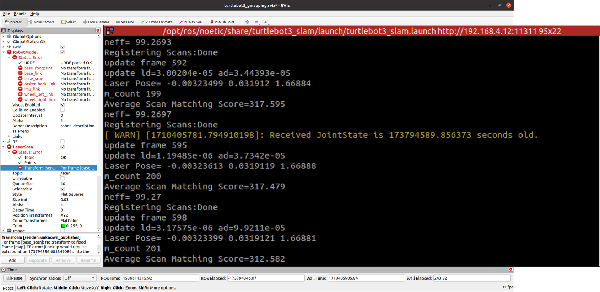

## 주요 issue 및 해결 방안 
### 1. SLAM error

위와 같이 TF 문제와 JointState error가 발생하는 경우 발생 

이 문제는 가끔 slam에서 발생하는 문제로 time 동기화 문제가 원인이다.  
#### 1.1. wifi 동굴을 사용하여 turtlebot3와 인터넷 연결을 활성화 한다.
```
sudo nano /etc/wpa_supplicant/wpa_supplicant.conf     
``` 
위 코드를 이용하여 와이파이 아이디, 비밀번호를 수정한다.
```
sudo systemctl daemon-reload # optional
sudo systemctl restart networking
sudo systemctl restart wpa_supplicant 
sudo service network-manager restart
```
#### 1.2. 아래와 같이 NTP와 RTC가 되어 있는지 확인한다. 
```
timedatectl
ping google.com # 연결되어 있는지 확인하기 
```  
만약에 문제가 계속 생긴다면 다음을 확인한다.
```
sudo nano /etc/resolv.conf # nameserver 8.8.8.8 와 8.8.4.4 있는지 확인 
sudo nano /etc/hosts # host 정보 확인 
```

### 2. Google cartographer
#### 2.1. Not build in noetic 
해결 방안은 catkin_make_isolated를 사용하거나 직접 의존 패키지를 설치하여 해결하는 방법이다.  
Catkin_make_isolated는 패키지 의존이 다 다르기에 문제가 발생한다. 
이에 현재 지금 정확한 build 방법을 찾고 있다. 

### 3. Realsense camera
현재 USB port 2.0을 사용하고 있기에 이미지, pointcloud를 사용할 때 문제가 발생한다. 

이에 아래와 같은 명령어를 사용하여 화질과 fps를 줄여서 진행한다.

