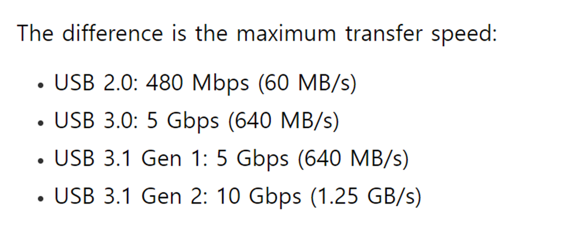

## 주요 issue 및 해결 방안 
### 1. SLAM error

위와 같이 TF 문제와 JointState error가 발생하는 경우 발생 

이 문제는 가끔 slam에서 발생하는 문제로 time 동기화 문제가 원인이다.  
#### 1.1. wifi 동굴을 사용하여 turtlebot3와 인터넷 연결을 활성화 한다.
```
sudo nano /etc/wpa_supplicant/wpa_supplicant.conf     
``` 
위 코드를 이용하여 와이파이 아이디, 비밀번호를 수정한다.
```
sudo systemctl daemon-reload # optional
sudo systemctl restart networking
sudo systemctl restart wpa_supplicant 
sudo service network-manager restart
```
#### 1.2. 아래와 같이 NTP와 RTC가 되어 있는지 확인한다. 
```
timedatectl
ping google.com # 연결되어 있는지 확인하기 
```  
만약에 문제가 계속 생긴다면 다음을 확인한다.
```
sudo nano /etc/resolv.conf # nameserver 8.8.8.8 와 8.8.4.4 있는지 확인 
sudo nano /etc/hosts # host 정보 확인 
```
### 2. Google cartographer
#### 2.1. Not build in noetic 
이는 소스 빌드로 해결할 수 있다. (메뉴얼 참조)
#### 2.2. Not build using cakin_make
이는 Google cartographer가 cakin_make으로 build하지 않아 생기는 문제이다.  
이를 해결하기 위해서 catkin_make가 아닌 catkin build로 생성한다. 
### 3. Realsense camera
현재 USB port 2.0을 사용하고 있기에 이미지, pointcloud를 사용할 때 문제가 발생한다. 

이에 아래와 같은 명령어를 사용하여 화질과 fps를 줄여서 진행한다.
#### 3.1. Only image
```
roslaunch realsense2_camera rs_camera.launch \
enable_color:=true \
enable_depth:=false \
enable_infra1:=false \
enable_infra2:=false \
enable_imu:=false \
enable_fisheye:=false \
color_width:=424 \
color_height:=240 \
color_fps:=15 \
enable_pointcloud:=false
```
#### 3.2. PointCloud
```
roslaunch realsense2_camera rs_camera.launch \
enable_color:=true \
enable_depth:=true \
enable_infra1:=false \
enable_infra2:=false \
enable_imu:=false \
enable_fisheye:=false \
depth_width:=480 \
depth_height:=270 \
depth_fps:=15 \
color_width:=424 \
color_height:=240 \
color_fps:=15 \
enable_pointcloud:=true \
pointcloud_texture_stream:=RS2_STREAM_COLOR \
pointcloud_texture_index:=0 \
align_depth:=true
```

### 4. Release problem
kinetic의 경우 현재 not support 하다. 이로 인하여 버전 match하는 문제가 발생한다. 이 때, 다음 과정으로 하길 추천한다.
1. 해당 패키지의 release 정보 확인한다.
2. [여기 사이트에서 찾는다](https://github.com/ros-gbp)
